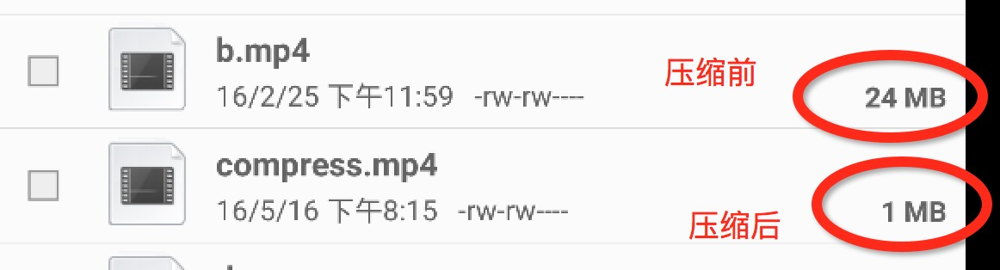
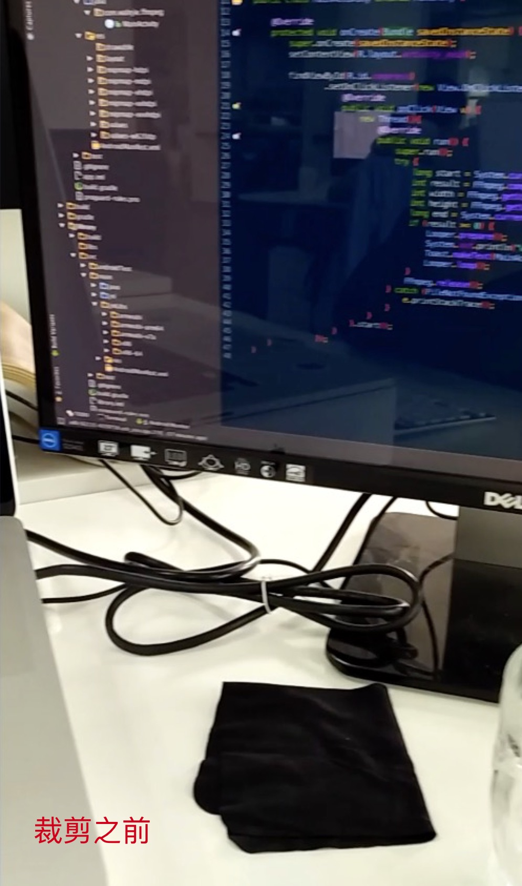
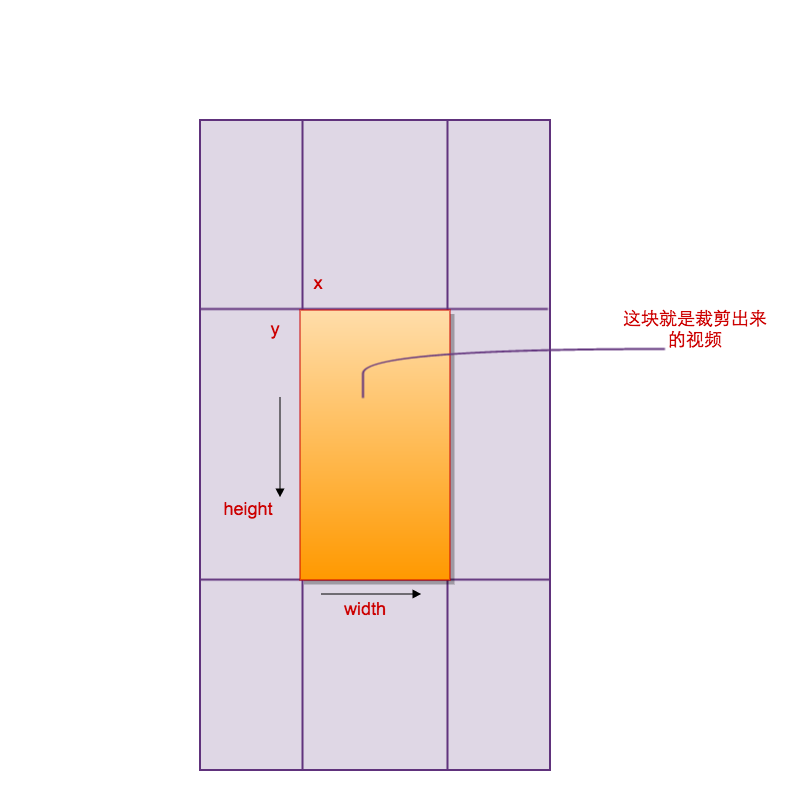
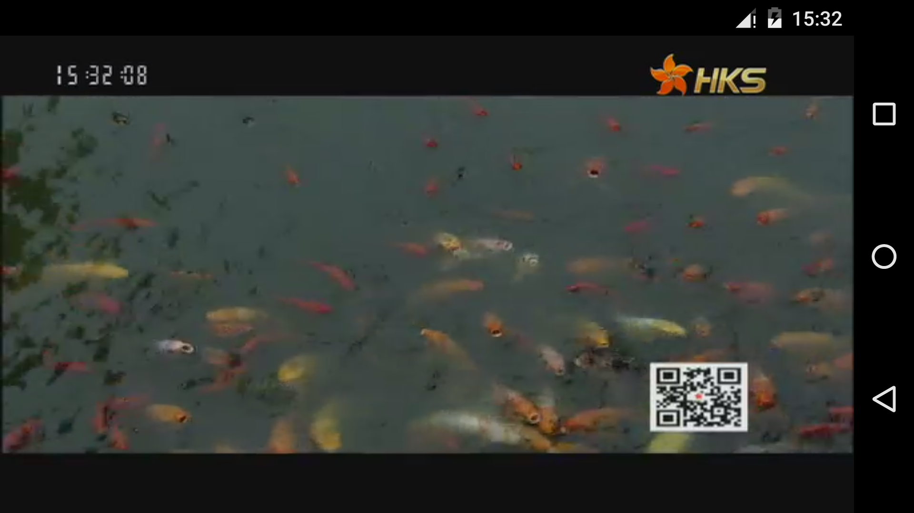

# 推流 所在项目 Streaming


#### 左边是推流端,右边是播放端, 由于gif图片过大,如果加载不出来,请查看art/streaming.gif

感谢
------

- [libx264](http://www.videolan.org/developers/x264.html)
- [fdk-aac](https://github.com/mstorsjo/fdk-aac)
- [srs-librtmp](https://github.com/ossrs/srs)
- [libyuv](https://chromium.googlesource.com/libyuv/libyuv/)

支持如下功能:
-------

- [x] Android mini API 16.
- [x] H.264/AAC 硬编.
- [x] H.264/AAC 软编.
- [x] 前后摄像头切换.

编译
------

```clone libx264```到```extra```目录,执行 ```sh tools/compile-x264.sh all``` 生成```libx264.a```静态库
导入```Streaming```到Android Studio

使用方式:

```java
encoder = new Encoder.Builder()
				// 是否使用软编
                .setSoftEncoder(Encoder.SOFT_ENCODE)
                // 设置CameraView
                .setCameraView(mCameraView)
                .build();
```

释放资源 调用代码如下:

```java
encoder.stop();
```

</br>
</br>
</br>

##### FFmpeg Library for Android

##### Building

    export ANDROID_NDK=you_ndk_path

因为arm64和x86,x86-64使用了yasm,所以需要安装yasm,由于我使用的是mac,所以使用brew安装,```brew install yasm```,brew安装文档[brew](http://brew.sh/index_zh-cn.html)

然后在终端运行

    ./build-android.sh

会去下载ffmpeg和x264的源码,编译完成之后会在```tools```目录下的```ffmpeg-build```下生成对应的libffmpeg.so,编译完成之后把项目导入Android Studio就可以了.

##### 使用



### 压缩

```java
FFmpeg ffmpeg = FFmpeg.getInstance();
ffmpeg.setInputDataSource("you input path");
ffmpeg.setOutputDataSource("you output path");
//视频的宽
int videoWidth = ffmpeg.getVideoWidth();
//视频的高
int videoHeight = ffmpeg.getVideoHeight();
//视频的角度,90,180,270,360
doule roation = ffmpeg.getRotation();
int result = ffmpeg.setCompress(需要缩放的宽,需要缩放的高);
ffmpeg.release();
//result >= 0 success
if (result < 0) {
    //error
}
```

### 裁剪

下面是裁剪的效果图


<figure>
    
    
    
</figure>

```java
FFmpeg ffmpeg = FFmpeg.getInstance();
ffmpeg.setInputDataSource("you input path");
ffmpeg.setOutputDataSource("you outpu path");
int result = ffmpeg.crop(x, y, width, height);
ffmpeg.release();
// result >= 0 success
if (result < 0) {
    //error
}
```

### 播放
采用FFmpeg + SDL2来进行解码和播放
###### note 目前还没有做快进和暂停操作,还有一些细节操作需要调整,不建议用在项目中


### About me:

wlanjie，
联系方式:qq:153920981 微信:w153920981
